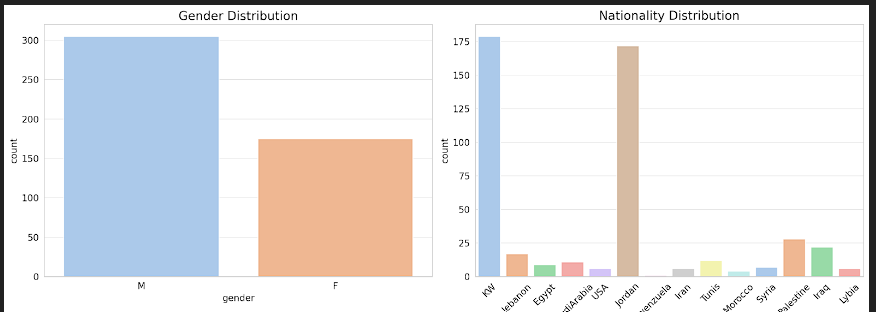
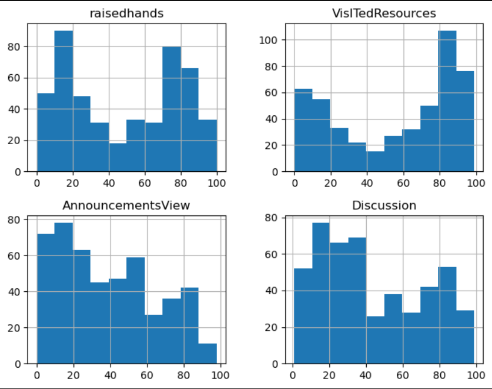
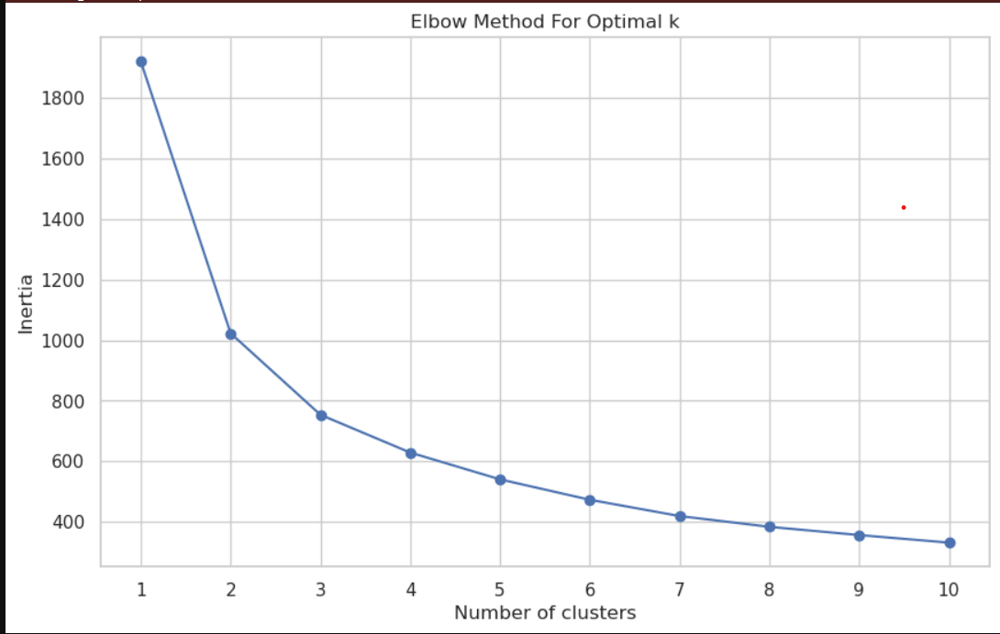
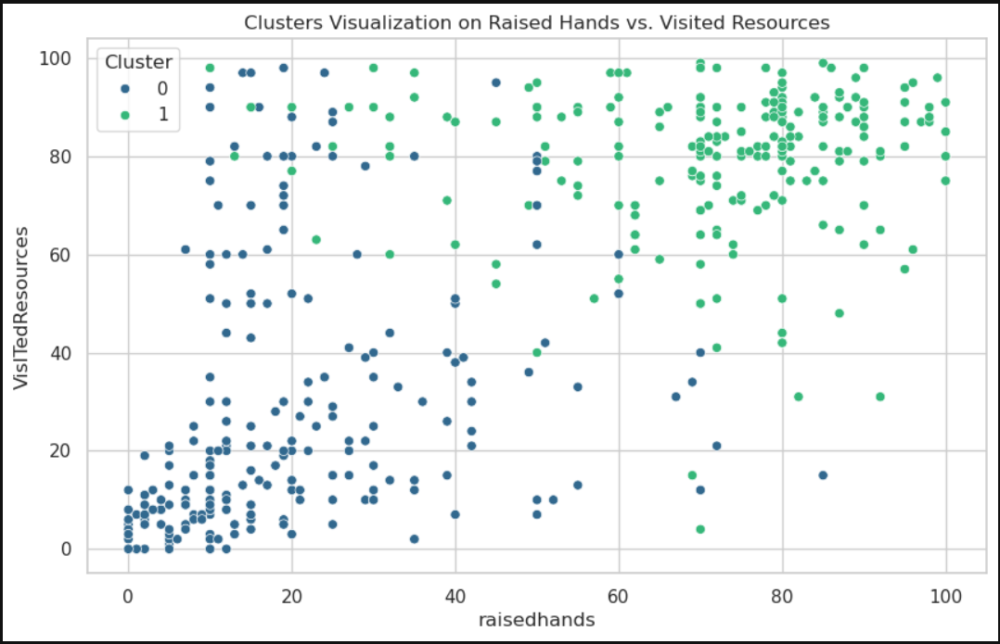
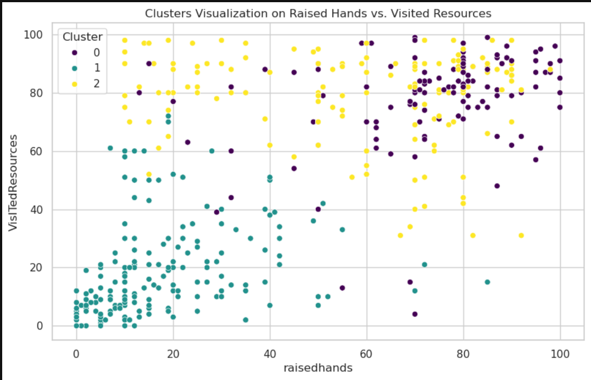

# Student Behavior Analysis Report

## Introduction
This report presents the findings from an exploratory data analysis and k-means clustering of a dataset concerning student behavior. The dataset includes various metrics indicative of student engagement, such as the number of times students raised their hands, visited resources, viewed announcements, and participated in discussions.

## Exploratory Data Analysis

### Categorical Data Distributions

- **Gender**: Includes both male (M) and female (F) students, with 175 entries for females.
- **Nationality and Place of Birth**: Represents a wide range of nationalities and places of birth, indicating diverse cultural backgrounds.
- **Academic Stages**: Includes lower level, middle school, and high school.
- **GradeID**: Spans from G-02 to G-12.
- **SectionID**: Distributed across three sections: A, B, and C.
- **Topic**: Covers subjects like IT, Math, Arabic, Science, English, among others.
- **Semester**: Covers both the first (F) and second (S) semesters.
- **Parental Engagement**: Includes metrics like parent answering survey and parental satisfaction with the school.

The dataset comprises several categorical and numerical features representing different aspects of student behavior and demographics. Key findings from the exploratory data analysis include:
- The dataset contains no missing values, indicating completeness across all features.
- Numerical features exhibit a wide range of engagement levels among students, with significant variance in behaviors such as raising hands and visiting resources.

   ### Gender Distribution
The first bar chart shows that there are more male students (denoted by 'M') than female students ('F') in the dataset.

   ### Nationality Distribution
The second bar chart illustrates a diverse range of nationalities among the students. A significant majority of the students are from two nationalities, indicated by the two tallest bars. Other nationalities have a much smaller representation in comparison.
  
  
  ### Histogram
  

- Raisedhands:
This histogram shows a bimodal distribution, with peaks around 10 and 70. This suggests there are two groups of students - those who rarely raise their hands and those who do so frequently.
 - VisitedResources:
The histogram for VisITedResources appears right-skewed, indicating that while many students visit resources frequently (peaks around 80-100), there's a significant number who do not engage as often.
 - AnnouncementsView:
The distribution for AnnouncementsView is less clear, but there appears to be a slight left skewness, with fewer students checking announcements very frequently, and more students doing so moderately.
 - Discussion:
The Discussion histogram is somewhat uniform but shows slight peaks around 20 and 70, suggesting that while student participation in discussions is spread out across different frequencies, there are concentrations of students who participate either moderately or very actively.

## K-Means Clustering
K-means clustering was applied to segment the students based on their engagement metrics. The Elbow Method suggested that 2 or 3 clusters provide a meaningful segmentation of the data.

### Clustering Results

- **With 2 Clusters:**
  - Cluster 0 (Dark Blue): This cluster primarily consists of students with lower levels of engagement, as shown by lower numbers of raised hands and fewer visits to resources. These students are clustered towards the bottom left corner of the plot, indicating minimal participation in class (as measured by raised hands) and possibly less utilization of available resources for learning.

  - Cluster 1 (Green): Students in this cluster have a higher level of engagement, with a wider spread along the raisedhands axis and generally higher values on the VisitedResources axis. This suggests that these students are more active in their learning process, both in terms of in-class participation and accessing learning materials.

- **With 3 Clusters:**
  - Cluster 0 (Blue): This cluster seems to contain students who have lower engagement levels, as indicated by both low raisedhands and VisitedResources scores. These students may need additional support or motivation to engage more in the classroom.

  - Cluster 1 (Yellow): Students in this cluster have a moderate to high level of resource visitation but a lower frequency of raising hands. This suggests that these students may be utilizing course materials and online resources but are less likely to participate actively in class discussions or question sessions.

  - Cluster 2 (Purple): This group shows high engagement in both raisedhands and VisitedResources. Students in this cluster are likely the most engaged, participating actively in class and making frequent use of the provided resources.

## Conclusion and Recommendations
The analysis reveals distinct segments within the student population based on their engagement levels. These insights can inform targeted strategies to enhance educational outcomes. Recommendations for interventions are tailored to each cluster's characteristics, aiming to boost engagement and participation.

### Recommendations for Educational Strategies
- Highly Engaged Students (Cluster 0 in 3-cluster solution): Continue to provide challenging and engaging materials and opportunities for discussions to keep these students stimulated.
- Low Engagement Students (Cluster 1 in 3-cluster solution): Implement interventions aimed at increasing engagement, such as personalized learning paths, gamification, and more interactive resources.
- Moderately Engaged Students (Cluster 2 in 3-cluster solution): Encourage more participation in discussions and classroom activities through group projects or peer-learning opportunities to increase their overall engagement.
This detailed analysis and the insights derived from it could be incorporated into a comprehensive report for stakeholders interested in improving student engagement and learning outcomes.

---

*This report was generated using exploratory data analysis and k-means clustering techniques to provide insights into student behavior and engagement patterns.*
